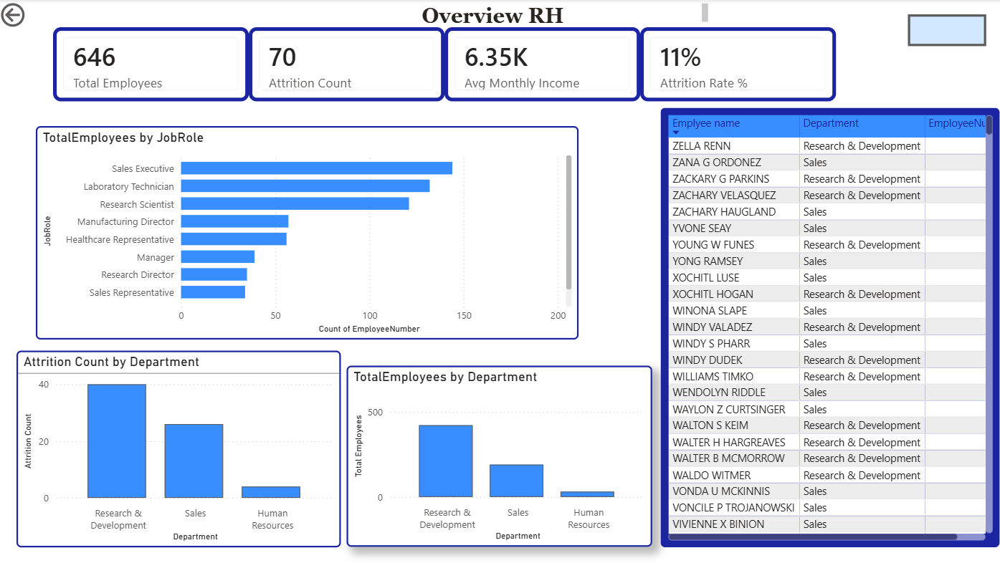
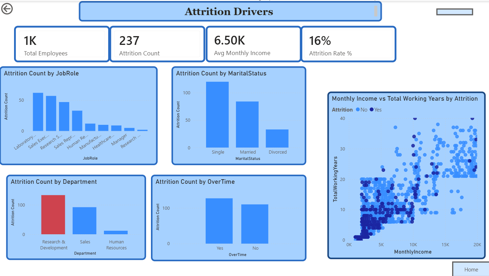
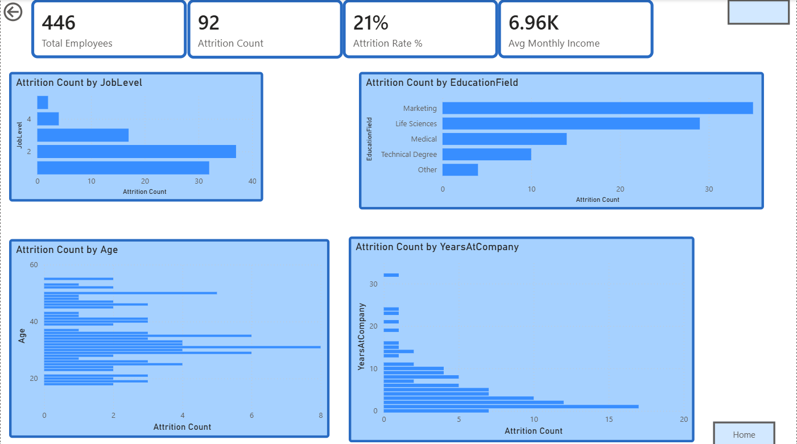
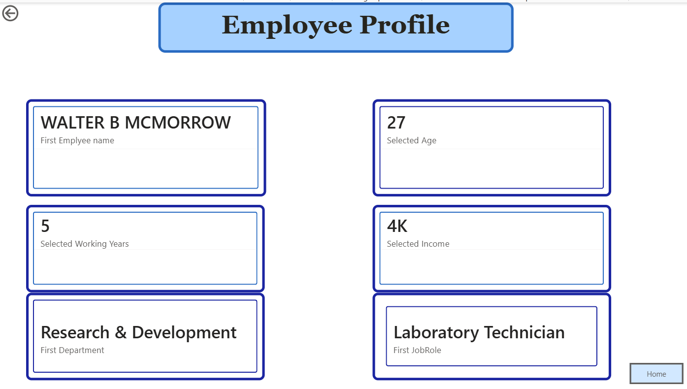

# HR Analytics Dashboard

An interactive Power BI project exploring employee departures, workforce composition, compensation, and tenure.

## Dashboard pages

* **Overview RH:** workforce KPIs and breakdowns by department and job role.
* **Attrition Drivers:** departures by job role, department, overtime, and marital status.
* **Compensation & Seniority:** analysis by age, education field, job level, and years at the company.
* **Employee Profile:** drill through from the employee table to view an individual employee's details.
* **Key Insights & Recommendations:** a summary of observations and questions for further HR analysis.

## Tools used

Power BI, Power Query, and DAX.

## How to open the dashboard

Download `HR_Analytics_Dashboard.pbix` from this repository and open it in Power BI Desktop. On **Overview RH**, right-click an employee in the table and select **Drill through → Employee Profile**.

## Interpretation

The dashboard describes patterns in the dataset. Differences in departure counts should not be treated as differences in attrition rates, and associations do not establish causes.
## Dashboard preview

### Overview RH

### Attrition Drivers

### Compensation & Seniority

### Employee Profile

